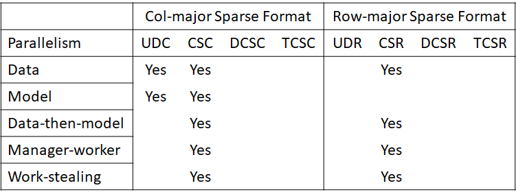
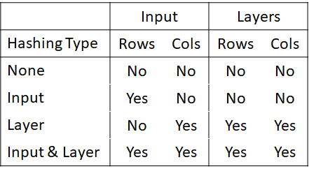
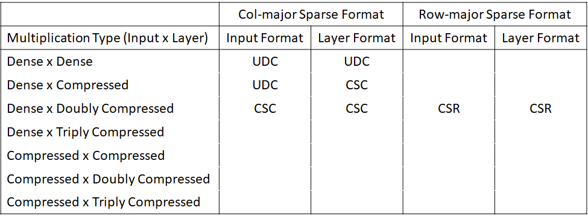

# DistSparseDNN

Distributed Sparse Deep Neural Network Inference

# Dependencies

- C++17 or higher
- Pthread, OpenMP, and NUMActl (optional)
- Python3 and TensorFlow2 (only for creating customized sparse DNN) 

## Install

    make

## Uninstall

    make clean

## Test

    bin/./app -i <input_ninstances input_nfeatures ncategories input_path> 
                   -n <nneurons nmax_layers layers_path> 
                   -c <input_compression_type[0-4] layer_compression_type[0-4]>
                   -p <parallelism_type[0-4]>
                   -h <hashing_type[0-3]>

## Supported Features

### Compression Types
<ol start="0">
  <li>Uncompressed Dense Column (UDC)</li>
  <li>Compressed Sparse Column (CSC)</li>
  <li>Doubly Compressed Sparse Column (DCSC) (not implemented yet)</li>
  <li>Triply Compressed Sparse Column (TCSC) (not implemented yet) </li>
  <li>Compressed Sparse Row (CSR)</li>
</ol>

### Parallelism Types
<ol start="0">
  <li>Model parallelism (supported UDC and CSC)</li>
  <li>Data parallelism (supported UDC, CSC, and CSR)</li>
  <li>Data-then-model parallelism (supported CSC and CSR)</li>
  <li>Manage-worker parallelism (supported CSC and CSR)</li>
  <li>Work-stealing parallelism (supported CSC and CSR)</li>
</ol>

### Hashing Types
<ol start="0">
  <li>No hashing</li>
  <li>Input hashing</li>
  <li>Layer hashing</li>
  <li>Input and layer hashing</li>
</ol>

## Supported Multiplication Types
<ol start="0">
  <li>Dense matrix by dense matrix</li>
  <li>Dense matrix by compressed matrix</li>
  <li>Compressed matrix by compressed matrix</li>
  <li>Compressed matrix by doubly compressed matrix (not implemented yet)</li>
  <li>Compressed matrix by triply compressed matrix (not implemented yet)</li>
</ol>

## Datasets

- Radixnet Sparse DNN: Download the MNIST and DNN files from http://graphchallenge.mit.edu/data-sets 
- Customized Sparse DNNs: Generate the sparse network using the sparse dnn generator program located under scripts/sparse_dnn_generator.py
	- Currently supported input datasets are MNIST, fashion MNIST, CIFAR-10, CIFAR-100, and IMDB. 

## Example Commands

For Radixnet Sparse DNN, e.g., for the smallest DNN use

    mpirun -np 4 bin/./radixnet -i 60000 1024 0 data/radixnet/bin/MNIST -n 1024 120 data/radixnet/bin/DNN -c 1 1 -p 0 -h 3

For other datasets e.g., for inferring fashion MNIST on a sparse DNN with 30 layers each with 2048 neurons use

    python3 scripts/sparse_dnn_generator.py fashion_mnist # Parameters are hardcoded
    mpirun -np 4 bin/./fashion_mnist -i 60000 784 10 data/fashion_mnist/bin/ -n 2048 30 data/fashion_mnist/bin/ -c 1 1 -p 0 -h 3

## Contact

Mohammad Hasnzadeh Mofrad (m.hasanzadeh.mofrad@gmail.com)